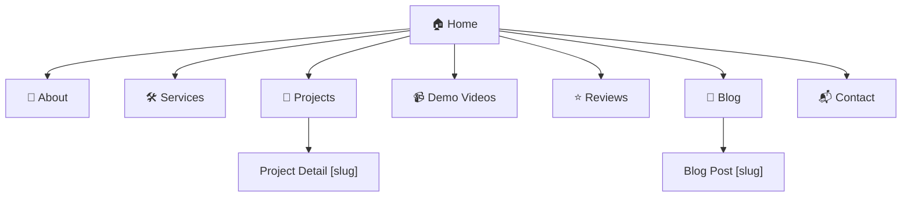
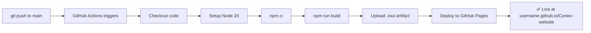

# Cortex Analytix — Premium Portfolio Website

Build a modern, dark-themed portfolio website for **Cortex Analytix** to showcase AI, ERP, Flutter, and full-stack projects. Hosted on **GitHub Pages** via static export. Inspired by Vercel, Linear, Clerk, and Raycast aesthetic — minimal yet premium.

---

## User Review Required

> [!IMPORTANT]
> **Brand Assets Needed**: Please provide the Cortex Analytix logo (SVG preferred), brand colors (if different from proposed purple/blue palette), and any specific tagline you'd like on the hero section.

> [!IMPORTANT]
> **Content Inventory**: The plan uses placeholder project data. You'll need to supply:
> - Real project screenshots/thumbnails for the Projects page
> - YouTube/Vimeo URLs for demo videos and testimonials
> - Client names, quotes, and photos for the Reviews section
> - Service descriptions and any case study write-ups

> [!WARNING]
> **GitHub Pages Custom Domain**: If you plan to use a custom domain (e.g., `cortexanalytix.com`) instead of `<username>.github.io/Cortex-website`, let me know — this affects the `basePath` and `assetPrefix` configuration. The current plan assumes a **repository sub-path** deployment.

> [!IMPORTANT]
> **Contact Form Provider**: The plan uses **EmailJS** (200 emails/month free) since this is a portfolio site with low-volume inquiries. If you prefer **Formspree** (50/month, but with a dashboard + spam protection), let me know.

---

## Open Questions

1. **Repository Name on GitHub** — What will the repo be called? (affects `basePath` in Next.js config, e.g., `/Cortex-website`)
2. **Google Analytics Measurement ID** — Do you already have a GA4 property set up? If not, I'll leave the slot ready.
3. **Microsoft Clarity Project ID** — Same question: do you have one, or should this be wired later?
4. **Blog — Immediate or Phase 2?** — The blog structure is included in the plan. Should I build it now (with 2-3 sample MDX posts) or stub it out for later?
5. **Multi-language support** — Is this needed at launch, or purely a future consideration?
6. **Number of initial projects to showcase** — How many projects should be pre-populated? (I'll create a JSON/MDX data model that makes adding more trivial.)

---

## Finalized Tech Stack

| Layer | Technology | Rationale |
|---|---|---|
| **Framework** | **Next.js 15** (App Router, Static Export) | Best DX, built-in SEO Metadata API, React Server Components, static `output: 'export'` |
| **Language** | **TypeScript** | Type safety, better IDE experience, maintainability |
| **Styling** | **Tailwind CSS v4** | CSS-first config (`@theme` in `globals.css`), utility-first, responsive by default |
| **Components** | **shadcn/ui** | Premium-quality, accessible, copy-paste components (Dialog, Card, Tabs, etc.) |
| **Animation** | **Motion** (formerly Framer Motion) v12+ | React 19 & Next.js 15 compatible, `import { motion } from "motion/react"` |
| **Icons** | **Lucide React** | Modern SVG icon set, tree-shakeable |
| **Fonts** | **Inter** (Google Fonts) | Clean, professional, matches premium SaaS aesthetic |
| **SEO** | **Next.js Metadata API** (built-in) | `next-seo` is obsolete with App Router — native `metadata` / `generateMetadata` is superior |
| **Video** | **YouTube / Vimeo Embed** | No self-hosting, lazy-loaded iframes with facade pattern |
| **Forms** | **EmailJS** | Client-side email sending, 200 emails/month free, no backend needed |
| **Analytics** | **Google Analytics 4 + Microsoft Clarity** | GA4 for traffic metrics; Clarity for heatmaps & session recordings (both free, platform-agnostic) |
| **Deployment** | **GitHub Actions → GitHub Pages** | Automated CI/CD on push to `main`, zero manual deployment |
| **Content** | **MDX files** (local) | Projects, blogs, case studies stored as MDX for easy content management |

---

## Website Structure & Pages



| Page | Key Sections |
|---|---|
| **Home** | Hero with animated gradient bg → Stats counter → Featured Projects grid → Services overview → Client testimonials carousel → CTA |
| **About** | Company story, mission, team, technology stack visualization |
| **Services** | 8 service cards (AI, ERP, Flutter, Web, Cloud, API, Automation, Analytics) with hover effects |
| **Projects** | Filterable portfolio grid → Category tabs → Project cards with tech badges |
| **Project Detail `[slug]`** | Problem/Solution, screenshots, tech stack, duration, live demo / GitHub / case study links |
| **Demo Videos** | YouTube/Vimeo embeds with lazy-loading facades, categorized (AI demos, ERP walkthroughs, Before/After) |
| **Reviews** | Video testimonials + text reviews, star ratings, client details |
| **Blog** | MDX-powered blog with categories, reading time, share links |
| **Contact** | EmailJS form, office location map (embed), social links |

---

## Proposed Changes

### Phase 1: Project Scaffolding & Configuration

#### [NEW] Project initialization

Initialize Next.js 15 with TypeScript, Tailwind CSS v4, ESLint, and App Router in the workspace directory:

```bash
npx -y create-next-app@latest ./ --typescript --tailwind --eslint --app --src-dir --no-import-alias
```

Then install additional dependencies:

```bash
npm install motion lucide-react @emailjs/browser
npx shadcn@latest init
```

---

#### [NEW] [next.config.mjs](file:///c:/Sigma_Projects/PersonalDocs/Project/Cortex-website/next.config.mjs)

Configure static export for GitHub Pages:

```typescript
const isProd = process.env.NODE_ENV === 'production';
const repoName = 'Cortex-website'; // adjust to actual repo name

const nextConfig = {
  output: 'export',
  basePath: isProd ? `/${repoName}` : '',
  assetPrefix: isProd ? `/${repoName}/` : '',
  images: { unoptimized: true },
  trailingSlash: true,
};
```

---

#### [NEW] [.github/workflows/deploy.yml](file:///c:/Sigma_Projects/PersonalDocs/Project/Cortex-website/.github/workflows/deploy.yml)

GitHub Actions workflow: checkout → setup Node 20 → `npm ci` → `npm run build` → upload `./out` → deploy to GitHub Pages.

---

#### [NEW] [public/.nojekyll](file:///c:/Sigma_Projects/PersonalDocs/Project/Cortex-website/public/.nojekyll)

Empty file to prevent GitHub Pages from running Jekyll (which ignores `_next/` folders).

---

### Phase 2: Design System & Global Styles

#### [NEW] [src/app/globals.css](file:///c:/Sigma_Projects/PersonalDocs/Project/Cortex-website/src/app/globals.css)

Tailwind v4 CSS-first design system with `@theme` directive defining:

- **Dark mode palette**: Near-black backgrounds (`#09090b`, `#0a0a0f`), purple accents (`#7c3aed` → `#a78bfa`), blue highlights (`#3b82f6` → `#60a5fa`)
- **Typography**: Inter font family, responsive font scales
- **Glass effect utilities**: `backdrop-blur`, translucent backgrounds
- **Custom animations**: `@keyframes` for gradient flow, text reveal, float, pulse-glow, spotlight
- **Gradient border utilities**
- **Shadcn/ui CSS variable overrides** for dark theme

---

#### [NEW] [src/app/layout.tsx](file:///c:/Sigma_Projects/PersonalDocs/Project/Cortex-website/src/app/layout.tsx)

Root layout with:
- Google Fonts (Inter) preconnect + link
- Global metadata (title template: `%s | Cortex Analytix`, description, OpenGraph defaults)
- Microsoft Clarity script (via `next/script`)
- GA4 script (via `next/script`, consent-aware)
- `<Header />` + `<Footer />` components
- Dark background class on `<body>`

---

### Phase 3: Shared Components

#### [NEW] [src/components/layout/Header.tsx](file:///c:/Sigma_Projects/PersonalDocs/Project/Cortex-website/src/components/layout/Header.tsx)

Fixed top navigation with glassmorphism (`bg-black/80 backdrop-blur-xl`):
- Cortex Analytix logo/wordmark
- Nav links: Home, About, Services, Projects, Videos, Reviews, Blog, Contact
- Mobile hamburger menu with slide-in drawer (shadcn Sheet)
- Active link highlighting
- Gradient "Contact" CTA button

#### [NEW] [src/components/layout/Footer.tsx](file:///c:/Sigma_Projects/PersonalDocs/Project/Cortex-website/src/components/layout/Footer.tsx)

Dark footer with columns: Company links, Services, Social media icons, newsletter CTA, copyright.

---

#### [NEW] Reusable UI Components

| Component | File | Purpose |
|---|---|---|
| `SectionHeading` | `src/components/ui/SectionHeading.tsx` | Animated section title + subtitle with gradient text |
| `GlassCard` | `src/components/ui/GlassCard.tsx` | Glassmorphism card with hover glow effect |
| `ProjectCard` | `src/components/ui/ProjectCard.tsx` | Portfolio card with image, tech badges, category, hover overlay |
| `ServiceCard` | `src/components/ui/ServiceCard.tsx` | Service card with icon, title, description, hover animation |
| `TestimonialCard` | `src/components/ui/TestimonialCard.tsx` | Review card with stars, quote, client avatar/name/role |
| `StatCounter` | `src/components/ui/StatCounter.tsx` | Animated number counter (intersection observer + spring animation) |
| `VideoEmbed` | `src/components/ui/VideoEmbed.tsx` | Lazy-loaded YouTube/Vimeo with click-to-play facade (performance) |
| `TechBadge` | `src/components/ui/TechBadge.tsx` | Small pill showing technology name with icon |
| `AnimatedBackground` | `src/components/ui/AnimatedBackground.tsx` | Animated gradient mesh / aurora effect for hero sections |
| `SpotlightCard` | `src/components/ui/SpotlightCard.tsx` | Card with mouse-following spotlight/glow effect |
| `PageTransition` | `src/components/ui/PageTransition.tsx` | Motion-based page enter/exit animation wrapper |
| `ScrollReveal` | `src/components/ui/ScrollReveal.tsx` | Intersection-observer triggered fade-in/slide-up wrapper |

---

### Phase 4: Content Data Layer

#### [NEW] [src/content/projects/](file:///c:/Sigma_Projects/PersonalDocs/Project/Cortex-website/src/content/projects/)

Each project as a TypeScript data file (or MDX when blog-like detail is needed):

```
src/content/projects/
├── cgm-application.ts
├── erp-solution.ts
├── ai-chatbot.ts
└── index.ts          ← exports all projects as typed array
```

**Project data shape:**
```typescript
interface Project {
  slug: string;
  title: string;
  category: 'ai' | 'erp' | 'flutter' | 'web' | 'cloud' | 'automation';
  description: string;
  problem: string;
  solution: string;
  technologies: string[];
  duration: string;
  thumbnail: string;       // path to image in /public/projects/
  screenshots: string[];
  liveUrl?: string;
  githubUrl?: string;
  caseStudyUrl?: string;
  featured: boolean;
}
```

#### [NEW] [src/content/services.ts](file:///c:/Sigma_Projects/PersonalDocs/Project/Cortex-website/src/content/services.ts)

Array of 8 services with icon name, title, description, features list.

#### [NEW] [src/content/reviews.ts](file:///c:/Sigma_Projects/PersonalDocs/Project/Cortex-website/src/content/reviews.ts)

Array of testimonials with client info, rating, quote, video URL (optional).

#### [NEW] [src/content/stats.ts](file:///c:/Sigma_Projects/PersonalDocs/Project/Cortex-website/src/content/stats.ts)

Statistics data: `{ label: string; value: number; suffix: string }[]` — e.g., `25+ Projects`, `10+ Technologies`, `98% Satisfaction`.

---

### Phase 5: Page Implementation

#### [NEW] [src/app/page.tsx](file:///c:/Sigma_Projects/PersonalDocs/Project/Cortex-website/src/app/page.tsx) — Home Page

| Section | Description |
|---|---|
| **Hero** | Full-viewport section with animated gradient mesh background, large heading with text reveal animation: "Transforming Businesses with AI, ERP Solutions & Modern Software", two CTA buttons (View Projects / Book a Demo), floating tech icons |
| **Client Logos** | Horizontal scrolling logo ticker (if logos available, else skip) |
| **Stats** | `StatCounter` components with spring-animated numbers |
| **Featured Projects** | 3-4 highlighted `ProjectCard` components in a responsive grid |
| **Services Overview** | Compact service cards linking to `/services` |
| **Testimonials** | Horizontal carousel of `TestimonialCard` components |
| **CTA Banner** | Gradient banner: "Ready to transform your business?" with contact button |

---

#### [NEW] [src/app/about/page.tsx](file:///c:/Sigma_Projects/PersonalDocs/Project/Cortex-website/src/app/about/page.tsx)

Company story, mission statement, team section (if team info provided), technology stack visualization (icon grid with hover tooltips).

---

#### [NEW] [src/app/services/page.tsx](file:///c:/Sigma_Projects/PersonalDocs/Project/Cortex-website/src/app/services/page.tsx)

8 `ServiceCard` components in a responsive grid with staggered entrance animations. Each card: icon, title, short description, feature bullets, "Learn More" link. Categories: AI Development, ERP Development, Flutter Apps, Web Applications, Cloud Solutions, API Development, Automation, Data Analytics.

---

#### [NEW] [src/app/projects/page.tsx](file:///c:/Sigma_Projects/PersonalDocs/Project/Cortex-website/src/app/projects/page.tsx)

- Category filter tabs (All, AI, ERP, Flutter, Web, Cloud, Automation) with animated underline indicator
- Responsive masonry-like grid of `ProjectCard` components
- Smooth layout animation when filtering (Motion `AnimatePresence` + `layout` prop)

#### [NEW] [src/app/projects/[slug]/page.tsx](file:///c:/Sigma_Projects/PersonalDocs/Project/Cortex-website/src/app/projects/%5Bslug%5D/page.tsx)

Dynamic project detail page:
- Hero image/screenshot
- Problem → Solution narrative
- Tech stack badges
- Duration and client info
- Screenshot gallery (lightbox)
- Links: Live Demo, GitHub, Case Study
- `generateStaticParams` for static generation
- `generateMetadata` for per-project SEO (title, description, OpenGraph image)
- Structured data (JSON-LD `SoftwareApplication` or `CreativeWork`)

---

#### [NEW] [src/app/videos/page.tsx](file:///c:/Sigma_Projects/PersonalDocs/Project/Cortex-website/src/app/videos/page.tsx)

- Category tabs: All, AI Demos, ERP Walkthroughs, Before/After, Screen Recordings
- Grid of `VideoEmbed` components (lazy-loaded with facade thumbnails)
- Each video: title, description, category badge

---

#### [NEW] [src/app/reviews/page.tsx](file:///c:/Sigma_Projects/PersonalDocs/Project/Cortex-website/src/app/reviews/page.tsx)

- Video testimonials section (embedded YouTube/Vimeo with `VideoEmbed`)
- Text testimonials grid with `TestimonialCard`
- Aggregate rating display (star visualization)
- JSON-LD `AggregateRating` structured data

---

#### [NEW] [src/app/blog/page.tsx](file:///c:/Sigma_Projects/PersonalDocs/Project/Cortex-website/src/app/blog/page.tsx) *(if building blog in Phase 1)*

- Blog post listing with cards (thumbnail, title, excerpt, date, reading time, category)
- MDX-powered content stored in `src/content/blogs/`

#### [NEW] [src/app/blog/[slug]/page.tsx](file:///c:/Sigma_Projects/PersonalDocs/Project/Cortex-website/src/app/blog/%5Bslug%5D/page.tsx)

- Individual blog post rendered from MDX
- `generateStaticParams` + `generateMetadata`
- Table of contents, share buttons, related posts

---

#### [NEW] [src/app/contact/page.tsx](file:///c:/Sigma_Projects/PersonalDocs/Project/Cortex-website/src/app/contact/page.tsx)

- Contact form (Name, Email, Phone, Company, Message, Service dropdown) powered by EmailJS
- Form validation (client-side)
- Success/error toast notifications
- Office info, social links
- Optional: Google Maps embed

---

### Phase 6: Animations & Micro-Interactions

All animations use **Motion** (`motion/react`):

| Animation | Where | Implementation |
|---|---|---|
| **Text Reveal** | Hero headings | Character-by-character stagger with `variants` |
| **Scroll Reveal** | All sections | `ScrollReveal` wrapper: fade-up with `whileInView` + `viewport={{ once: true }}` |
| **Page Transitions** | All pages | `AnimatePresence` wrapping page content with fade/slide |
| **Parallax** | Hero background, images | `useScroll` + `useTransform` for Y-offset |
| **Hover Effects** | Cards, buttons | `whileHover={{ scale: 1.02, y: -4 }}` + glow intensification |
| **Mouse Spotlight** | `SpotlightCard` | `onMouseMove` tracking → radial gradient at cursor position |
| **Number Counters** | Stats section | `useMotionValue` + `useSpring` + `useInView` |
| **Gradient Flow** | Hero background | CSS `@keyframes` with `background-position` animation |
| **Glassmorphism** | Cards, header | `backdrop-blur-xl` + translucent `bg-white/5` |
| **Stagger Children** | Grids, lists | `staggerChildren: 0.1` in parent `variants` |
| **Filter Layout** | Project grid | `layout` prop on `motion.div` for smooth reflow during filter |

---

### Phase 7: SEO & Performance

#### SEO Implementation

| Feature | Approach |
|---|---|
| **Page Metadata** | `export const metadata: Metadata` or `generateMetadata()` on every page |
| **OpenGraph** | Default OG image in root layout, per-project OG images |
| **Structured Data** | JSON-LD in `<script>` tags: Organization, BreadcrumbList, Service, SoftwareApplication, AggregateRating |
| **Sitemap** | `src/app/sitemap.ts` — auto-generated from project/blog slugs |
| **Robots** | `src/app/robots.ts` — allow all, point to sitemap |
| **Canonical URLs** | Set via `alternates.canonical` in metadata |

#### Performance Targets

| Metric | Target |
|---|---|
| **Lighthouse Performance** | 95+ |
| **Lighthouse Accessibility** | 95+ |
| **Lighthouse Best Practices** | 95+ |
| **Lighthouse SEO** | 100 |
| **First Contentful Paint** | < 1.5s |
| **Largest Contentful Paint** | < 2.5s |
| **Cumulative Layout Shift** | < 0.1 |

**Optimization Strategies:**
- Static generation (zero server runtime)
- `next/image` with `unoptimized: true` (GitHub Pages limitation) + proper `width`/`height` to prevent CLS
- Lazy-loaded video embeds (facade pattern — show thumbnail, load iframe on click)
- Font preloading (Inter via Google Fonts with `display=swap`)
- Minimal client-side JavaScript (leverage Server Components)
- `next/script` with `strategy="afterInteractive"` for analytics
- CSS `content-visibility: auto` for off-screen sections

---

### Phase 8: Analytics Integration

#### [MODIFY] [src/app/layout.tsx](file:///c:/Sigma_Projects/PersonalDocs/Project/Cortex-website/src/app/layout.tsx)

Add `<Script>` tags for:
- **Google Analytics 4** — with consent-mode v2 defaults
- **Microsoft Clarity** — session recordings and heatmaps

Both use environment variables (`NEXT_PUBLIC_GA_ID`, `NEXT_PUBLIC_CLARITY_ID`) so keys stay out of code.

---

## Design Theme Details

### Color Palette

| Token | Value | Usage |
|---|---|---|
| `--background` | `#09090b` | Page background |
| `--surface` | `#0f0f14` | Card backgrounds |
| `--surface-hover` | `#1a1a24` | Card hover state |
| `--border` | `rgba(255,255,255,0.08)` | Subtle borders |
| `--text-primary` | `#fafafa` | Headings, body |
| `--text-secondary` | `#a1a1aa` | Descriptions, meta |
| `--accent-purple` | `#7c3aed` → `#a78bfa` | Primary accent gradient |
| `--accent-blue` | `#3b82f6` → `#60a5fa` | Secondary accent gradient |
| `--accent-cyan` | `#06b6d4` | Tertiary accent |
| `--gradient-hero` | `purple → blue → cyan` | Hero background mesh |

### Typography

| Element | Size (desktop) | Weight |
|---|---|---|
| Hero H1 | `4.5rem` / `72px` | 800 (Extra Bold) |
| Section H2 | `2.5rem` / `40px` | 700 (Bold) |
| Card Title | `1.25rem` / `20px` | 600 (Semi Bold) |
| Body | `1rem` / `16px` | 400 (Regular) |
| Caption | `0.875rem` / `14px` | 400 |

---

## Folder Structure

```
Cortex-website/
├── .github/
│   └── workflows/
│       └── deploy.yml                 ← GitHub Actions CI/CD
├── public/
│   ├── .nojekyll                      ← Prevent Jekyll processing
│   ├── favicon.ico
│   ├── og-default.jpg                 ← Default OpenGraph image
│   └── projects/                      ← Project screenshots & thumbnails
│       ├── cgm-app-thumb.webp
│       └── ...
├── src/
│   ├── app/
│   │   ├── layout.tsx                 ← Root layout (fonts, metadata, analytics, Header/Footer)
│   │   ├── page.tsx                   ← Home page
│   │   ├── globals.css                ← Tailwind v4 + design system
│   │   ├── sitemap.ts                 ← Auto-generated sitemap
│   │   ├── robots.ts                  ← Robots.txt config
│   │   ├── about/page.tsx
│   │   ├── services/page.tsx
│   │   ├── projects/
│   │   │   ├── page.tsx               ← Projects listing
│   │   │   └── [slug]/page.tsx        ← Project detail
│   │   ├── videos/page.tsx
│   │   ├── reviews/page.tsx
│   │   ├── blog/
│   │   │   ├── page.tsx               ← Blog listing
│   │   │   └── [slug]/page.tsx        ← Blog post
│   │   └── contact/page.tsx
│   ├── components/
│   │   ├── layout/
│   │   │   ├── Header.tsx
│   │   │   └── Footer.tsx
│   │   └── ui/
│   │       ├── SectionHeading.tsx
│   │       ├── GlassCard.tsx
│   │       ├── ProjectCard.tsx
│   │       ├── ServiceCard.tsx
│   │       ├── TestimonialCard.tsx
│   │       ├── StatCounter.tsx
│   │       ├── VideoEmbed.tsx
│   │       ├── TechBadge.tsx
│   │       ├── AnimatedBackground.tsx
│   │       ├── SpotlightCard.tsx
│   │       ├── PageTransition.tsx
│   │       └── ScrollReveal.tsx
│   ├── content/
│   │   ├── projects/
│   │   │   ├── cgm-application.ts
│   │   │   ├── erp-solution.ts
│   │   │   └── index.ts
│   │   ├── services.ts
│   │   ├── reviews.ts
│   │   └── stats.ts
│   └── lib/
│       ├── utils.ts                   ← Utility functions (cn, etc.)
│       └── emailjs.ts                 ← EmailJS configuration
├── next.config.mjs
├── tailwind.config.ts                 ← Minimal (v4 uses CSS-first, but shadcn may still need this)
├── tsconfig.json
├── postcss.config.mjs
├── package.json
└── README.md
```

---

## CI/CD Pipeline



---

## Future-Proofing

This architecture supports easy expansion:

| Future Feature | How to Add |
|---|---|
| **AI Chatbot** | Add client-side widget (e.g., ChatGPT API with streaming) |
| **MDX Blog** | Already structured — just add `.mdx` files to `src/content/blogs/` |
| **Search** | Client-side search with FlexSearch or Fuse.js over static content |
| **Multi-language (i18n)** | Next.js Internationalization + locale-based routing |
| **CMS Integration** | Swap file-based content for Contentful/Sanity API calls in `generateStaticParams` |
| **Admin Dashboard** | Migrate to Vercel hosting (remove `output: 'export'`) for API routes |

---

## Verification Plan

### Automated Tests
```bash
# Build verification (ensures static export succeeds)
npm run build

# Type checking
npx tsc --noEmit

# Lint
npm run lint
```

### Manual Verification
- **Visual Review**: Open the built site locally (`npx serve out/`) and walk through every page
- **Mobile Responsiveness**: Test at 375px, 768px, 1024px, 1440px breakpoints
- **Lighthouse Audit**: Run Chrome DevTools Lighthouse on Home, Projects, and Contact pages — target 95+ on all metrics
- **Animation Performance**: Verify smooth 60fps animations, no jank on scroll
- **SEO Check**: Inspect `<head>` meta tags, OpenGraph previews (via metatags.io), and JSON-LD structured data
- **Cross-browser**: Test in Chrome, Firefox, Safari, Edge
- **GitHub Pages Deployment**: Push to GitHub, verify the Actions workflow completes and the site is live

---

## Implementation Phases Summary

| Phase | Scope | Est. Files |
|---|---|---|
| **1** | Project scaffolding, Next.js config, GitHub Actions | ~5 config files |
| **2** | Design system, globals.css, root layout | ~2 files |
| **3** | Shared components (Header, Footer, 12 UI components) | ~14 files |
| **4** | Content data layer (projects, services, reviews, stats) | ~8 files |
| **5** | All pages (Home, About, Services, Projects, Videos, Reviews, Blog, Contact) | ~10 page files |
| **6** | Animation polish & micro-interactions | Integrated into above |
| **7** | SEO (metadata, sitemap, robots, structured data) | ~3 files + metadata in pages |
| **8** | Analytics (GA4 + Clarity) | Additions to layout.tsx |
| **Total** | | **~40-45 files** |
